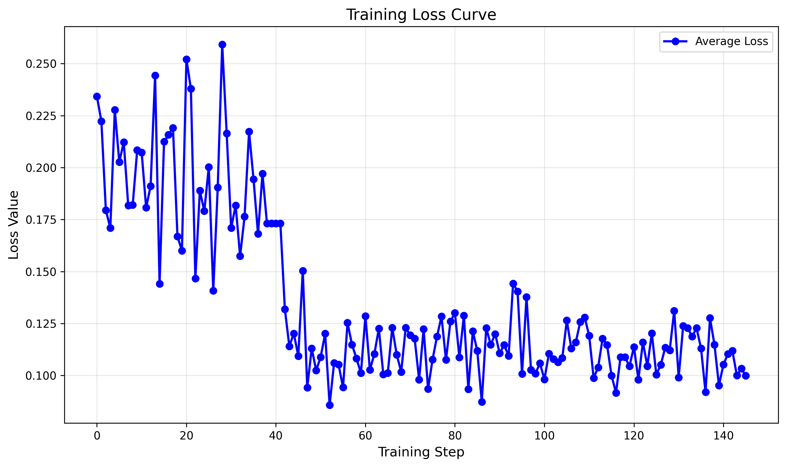

# 介绍

本项目主要复现论文代码《React:synergizing reasoning and acting in language models》

因为时间有限，以数据集hotpotqa为例进行复现：
复现内容一：采用react架构测试模型效果；
复现内容二：采用torch与jittor两种框架对模型进行微调。


## 目录与内容介绍
```mermaid


llama-3.1-8b 本地模型的数据文件；
data hotpotqqa数据集；
prompt 提示词内容；
hotpotqa_react.py 用于展示模型直接调用API的效果；
hotpotqa_finepytorch.py 使用torch框架的微调；
jittor_llama
  --hotpotqa_finetuning.py 使用jittor框架微调；
  --jittor_llama.py 使用jjittor框架重写transformer架构；
  --jittor_model.py 重构本地模型存储格式，方便jittor使用；
wikienv.py 支撑论文的search检索；
wrappers.py 记录模型回答正确与否，并统计正确率；
...


```
## 环境配置

### 虚拟环境
python 3.12
cuda 12.0
torch 2.5.1+cu120
jittor 1.3.7.24

```bash
### 关于jittor安装的说明
# 安装g++11
sudo apt install g++-11
# 设置g++11为默认编译器
sudo update-alternatives --install /usr/bin/g++ g++ /usr/bin/g++-11 100
# 测试g++版本
g++ --version
#  创建一个jittor环境, 名字为jittor_env, python版本为3.12，python版本选择喜好即可，官方推荐要>=3.8
conda create -n jittor_env python=3.12
# 进入jittor环境
conda activate jittor_env
# 安装jittor
pip install jittor
# 解决GLIBCXX_3.4.30缺失
conda install -c conda-forge libstdcxx-ng=12.3.0 -y
# 测试
python -m jittor.test.test_cudnn_op
```
ps: 这里总是发生GPU检测不到的错误：python -m jittor_utils.query_cuda_cc / 
### 安装包
```bash
Package                  Version
------------------------ ------------
accelerate               1.8.1
aiohappyeyeballs         2.6.1
aiohttp                  3.12.14
aiosignal                1.4.0
astunparse               1.6.3
async-timeout            5.0.1
attrs                    25.3.0
beautifulsoup4           4.13.4
bitsandbytes             0.46.1
blobfile                 3.0.0
bs4                      0.0.2
certifi                  2025.7.9
cffi                     1.17.1
charset-normalizer       3.4.2
cloudpickle              3.1.1
contourpy                1.3.2
cryptography             45.0.5
cycler                   0.12.1
datasets                 4.0.0
dill                     0.3.8
filelock                 3.18.0
fonttools                4.58.5
frozenlist               1.7.0
fsspec                   2025.3.0
gym                      0.26.2
gym-notices              0.0.8
hf-xet                   1.1.5
huggingface-hub          0.33.4
idna                     3.10
Jinja2                   3.1.4
jittor                   1.3.9.14
kiwisolver               1.4.8
lxml                     6.0.0
MarkupSafe               2.1.5
matplotlib               3.10.3
modelscope               1.28.0
mpmath                   1.3.0
multidict                6.6.3
multiprocess             0.70.16
networkx                 3.3
numpy                    1.26.4
nvidia-cublas-cu12       12.8.3.14
nvidia-cuda-cupti-cu12   12.8.57
nvidia-cuda-nvrtc-cu12   12.8.61
nvidia-cuda-runtime-cu12 12.8.57
nvidia-cudnn-cu12        9.7.1.26
nvidia-cufft-cu12        11.3.3.41
nvidia-cufile-cu12       1.13.0.11
nvidia-curand-cu12       10.3.9.55
nvidia-cusolver-cu12     11.7.2.55
nvidia-cusparse-cu12     12.5.7.53
nvidia-cusparselt-cu12   0.6.3
nvidia-nccl-cu12         2.26.2
nvidia-nvjitlink-cu12    12.8.61
nvidia-nvtx-cu12         12.8.55
opencv-python            4.12.0.88
packaging                25.0
pandas                   2.3.1
peft                     0.16.0
pillow                   11.0.0
pip                      25.1
propcache                0.3.2
protobuf                 6.31.1
psutil                   7.0.0
pyarrow                  20.0.0
pycparser                2.22
pycryptodomex            3.23.0
pyOpenSSL                25.1.0
pyparsing                3.2.3
python-dateutil          2.9.0.post0
pytz                     2025.2
PyYAML                   6.0.2
regex                    2024.11.6
requests                 2.32.4
safetensors              0.5.3
setuptools               78.1.1
six                      1.17.0
soupsieve                2.7
sympy                    1.13.3
tiktoken                 0.9.0
tokenizers               0.21.2
torch                    2.5.1+cu120
torchaudio               2.5.1+cu120
torchvision              0.22.1+cu120
tqdm                     4.67.1
transformers             4.53.2
triton                   3.3.1
typing_extensions        4.14.1
tzdata                   2025.2
urllib3                  2.5.0
wheel                    0.45.1
xxhash                   3.5.0
yarl                     1.20.1
astunparse               1.6.3
jittor                   1.3.9.14
numpy                    1.26.4
pillow                   11.3.0
pip                      25.1
setuptools               78.1.1
six                      1.17.0
tqdm                     4.67.1
wheel                    0.45.1

```

## 数据准备

微调的数据来源于react框架结合大模型API与维基百科API的正确回答

1.因为Palm已经退出市场，所以另外选取一些模型生成问答对数据以供微调，以下为不同模型下的正答率（注：这里QWEN系列随着参数扩大正确率也不会再上升）

|           |     QWEN2.5-7b      |     QWEN3-14b     |      Llama-3.1-8b       |      Llama-3.3-70B      |
|-----------|---------------------|-------------------|-------------------------|-------------------------|
| HotpotQA  | 15.6%               | 20.2%             | 17.8%                   |31.25%                   |

2.得到数据question + react + answer 数据共300余条。（原论文为3000条，但是由于API限制和人力限制，这里数量较少）

3.将数据处理成aplaca格式，并且编码以待微调。

```python
##其中tokenizer为自定义
def process_func(example):
    MAX_LENGTH = 600
    system_prompt = f"<|begin_of_text|><|start_header_id|>system<|end_header_id|>\n\nCutting Knowledge Date: December 2023\nToday Date: 26 Jul 2024\n\n<|eot_id|>"
    user_prompt = f"<|start_header_id|>user<|end_header_id|>\n\n{example['instruction'] + example['input']}<|eot_id|>"
    assistant_prompt = f"<|start_header_id|>assistant<|end_header_id|>\n\n"

    system_ids = tokenizer(system_prompt, add_special_tokens=False).get("input_ids", [])
    user_ids = tokenizer(user_prompt, add_special_tokens=False).get("input_ids", [])
    assistant_ids = tokenizer(assistant_prompt, add_special_tokens=False).get("input_ids", [])
    response_ids = tokenizer(f"{example['output']}<|eot_id|>", add_special_tokens=False).get("input_ids", [])
   
    # 处理空值和长度截断
    system_ids = system_ids if system_ids is not None else []
    user_ids = user_ids if user_ids is not None else []
    assistant_ids = assistant_ids if assistant_ids is not None else []
    response_ids = response_ids if response_ids is not None else []
    
    total_len = len(system_ids) + len(user_ids) + len(assistant_ids) + len(response_ids)
    if total_len > MAX_LENGTH:
        response_ids = response_ids[: (MAX_LENGTH - len(system_ids) - len(user_ids) - len(assistant_ids))]
    
    # 构建输入和标签
    input_ids = system_ids + user_ids + assistant_ids + response_ids
    if not input_ids:
        input_ids = [tokenizer.pad_token_id] * MAX_LENGTH
    attention_mask = [1] * len(input_ids)
    labels = [-100] * (len(system_ids) + len(user_ids) + len(assistant_ids)) + response_ids
    
    # 填充到固定长度
    pad_len = MAX_LENGTH - len(input_ids)
    if pad_len > 0:
        input_ids += [tokenizer.pad_token_id] * pad_len
        attention_mask += [0] * pad_len
        labels += [-100] * pad_len
    if len(input_ids) > MAX_LENGTH:
        input_ids = input_ids[:MAX_LENGTH]
        attention_mask = attention_mask[:MAX_LENGTH]
        labels = labels[:MAX_LENGTH]
    return {
        "input_ids": input_ids,
        "attention_mask": attention_mask,
        "labels": labels
    }

```

## 训练脚本（训练代码见hotpotqa_finepytorch.py\hotpotqa_finetuning.py）
```bash
#!/bin/bash

# 激活环境
source ~/miniconda3/etc/profile.d/conda.sh
conda activate Re


# 运行训练脚本
python hotpotqa_finepytorch.py \
    --model_path "/home/pcx/content/llama/llama-3.1-8b" \
    --data_path "data_train.jsonl" \
    --output_dir "./output/llama3_1_instruct_lora" \
    --per_device_train_batch_size 1 \
    --gradient_accumulation_steps 16 \
    --learning_rate 1e-4 \
    --num_train_epochs 3 \
    --lora_r 8 \
    --lora_alpha 32 \
    --lora_dropout 0.1 \
    --fp16 True \
    --optim paged_adamw_8bit \
    --low_cpu_mem_usage True 

echo "训练完成！模型保存在: ./output/llama3_1_instruct_lora"
```

## 测试脚本(测试代码见hotpotqa_react.py)
```bash
#!/bin/bash

##运行本地模型测试问答
python hotpotqa.py
```

## log日志

#### pytorch日志

```bash
[2025-07-14 10:00:00] ==============================================
[2025-07-14 10:00:00] 训练任务启动
[2025-07-14 10:00:00] 训练命令：
[2025-07-14 10:00:00] python hotpotqa_finepytorch.py \
    --model_path "/home/pcx/content/llama/llama-3.1-8b" \
    --data_path "data_train.jsonl" \
    --output_dir "./output/llama3_1_instruct_lora" \
    --per_device_train_batch_size 1 \
    --gradient_accumulation_steps 16 \
    --learning_rate 1e-4 \
    --num_train_epochs 3 \
    --lora_r 8 \
    --lora_alpha 32 \
    --lora_dropout 0.1 \
    --fp16 True \
    --optim paged_adamw_8bit \
    --low_cpu_mem_usage True
[2025-07-14 10:00:00] ==============================================

[2025-07-14 10:00:10] 加载模型：/home/pcx/content/llama/llama-3.1-8b
[2025-07-14 10:00:30] 加载数据集：data_train.jsonl
[2025-07-14 10:00:50] 配置 LoRA 参数：r=8, alpha=32, dropout=0.1
[2025-07-14 10:01:00] 开始训练（共 3 个 epoch）
[2025-07-14 10:01:00] Epoch 1/3 启动

[2025-07-14 10:01:05] Step: 0, Loss: 0.23427265882492065
[2025-07-14 10:01:10] Step: 1, Loss: 0.22226962447166443
[2025-07-14 10:01:15] Step: 2, Loss: 0.179470494389534
[2025-07-14 10:01:20] Step: 3, Loss: 0.1709262728691101
[2025-07-14 10:01:25] Step: 4, Loss: 0.22776849567890167
[2025-07-14 10:01:30] Step: 5, Loss: 0.20268379151821136
...
[2025-07-14 12:30:00] Step: 143, Loss: 0.12381625175476074
[2025-07-14 12:30:05] Step: 144, Loss: 0.2289034575223923
[2025-07-14 12:30:10] Step: 145, Loss: 0.11879074573516846
```




#### jittor日志

目前正在调试bug，还差一点跑完
```bash
[i 0714 05:25:41.785895 96 compiler.py:956] Jittor(1.3.9.14) src: /home/pcx/miniconda3/envs/ji/lib/python3.12/site-packages/jittor
[i 0714 05:25:41.787249 96 compiler.py:957] g++ at /usr/bin/g++(11.4.0)
[i 0714 05:25:41.787317 96 compiler.py:958] cache_path: /home/pcx/.cache/jittor/jt1.3.9/g++11.4.0/py3.12.11/Linux-6.6.87.2x52/IntelRCoreTMi7x03/2372/default
[i 0714 05:25:41.855314 96 install_cuda.py:96] cuda_driver_version: [12, 8]
[i 0714 05:25:41.855457 96 install_cuda.py:84] restart /home/pcx/miniconda3/envs/ji/bin/python ['-c', 'import jittor; print(jittor.has_cuda)']
[i 0714 05:25:41.908088 36 compiler.py:956] Jittor(1.3.9.14) src: /home/pcx/miniconda3/envs/ji/lib/python3.12/site-packages/jittor
[i 0714 05:25:41.909578 36 compiler.py:957] g++ at /usr/bin/g++(11.4.0)
[i 0714 05:25:41.909643 36 compiler.py:958] cache_path: /home/pcx/.cache/jittor/jt1.3.9/g++11.4.0/py3.12.11/Linux-6.6.87.2x52/IntelRCoreTMi7x03/2372/default
[i 0714 05:25:41.966978 36 install_cuda.py:96] cuda_driver_version: [12, 8]
[i 0714 05:25:41.968789 36 __init__.py:412] Found /home/pcx/.cache/jittor/jtcuda/cuda12.2_cudnn8_linux/bin/nvcc(12.2.140) at /home/pcx/.cache/jittor/jtcuda/cuda12.2_cudnn8_linux/bin/nvcc.
[i 0714 05:25:41.970213 36 __init__.py:412] Found addr2line(2.42) at /usr/bin/addr2line.
[e 0714 05:25:42.030283 36 compiler.py:1006] No GPU Device Found!
[i 0714 05:25:42.030412 36 compiler.py:1013] cuda key:cu12.2.140_sm_
[i 0714 05:25:42.191055 36 __init__.py:227] Total mem: 15.44GB, using 5 procs for compiling.
[i 0714 05:25:42.235059 36 jit_compiler.cc:28] Load cc_path: /usr/bin/g++
[i 0714 05:25:42.418470 36 init.cc:63] Found cuda archs: [89,]
```


## 引用内容

```bibtex
@inproceedings{yao2023react,
  title = {{ReAct}: Synergizing Reasoning and Acting in Language Models},
  author = {Yao, Shunyu and Zhao, Jeffrey and Yu, Dian and Du, Nan and Shafran, Izhak and Narasimhan, Karthik and Cao, Yuan},
  booktitle = {International Conference on Learning Representations (ICLR) },
  year = {2023},
  html = {https://arxiv.org/abs/2210.03629},
}
```

Run ``{hotpotqa,fever,alfworld,webshop}.ipynb``. As HotpotQA and FEVER have large validation sets, we only run 500 random examples (see notebooks). We find PaLM and GPT-3 are better at different tasks.


